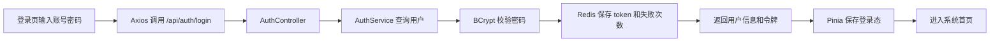
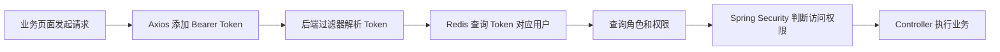
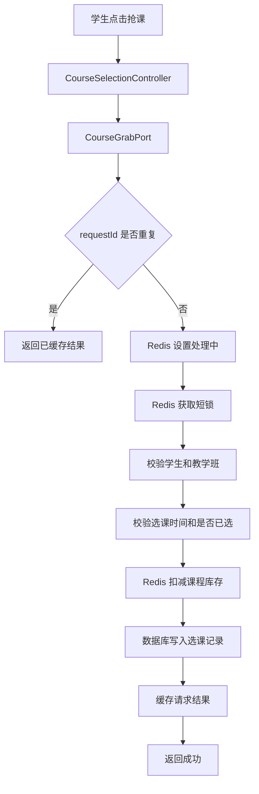
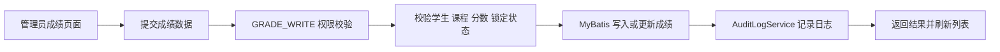
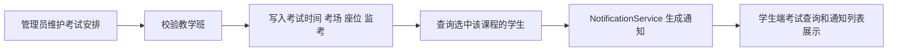
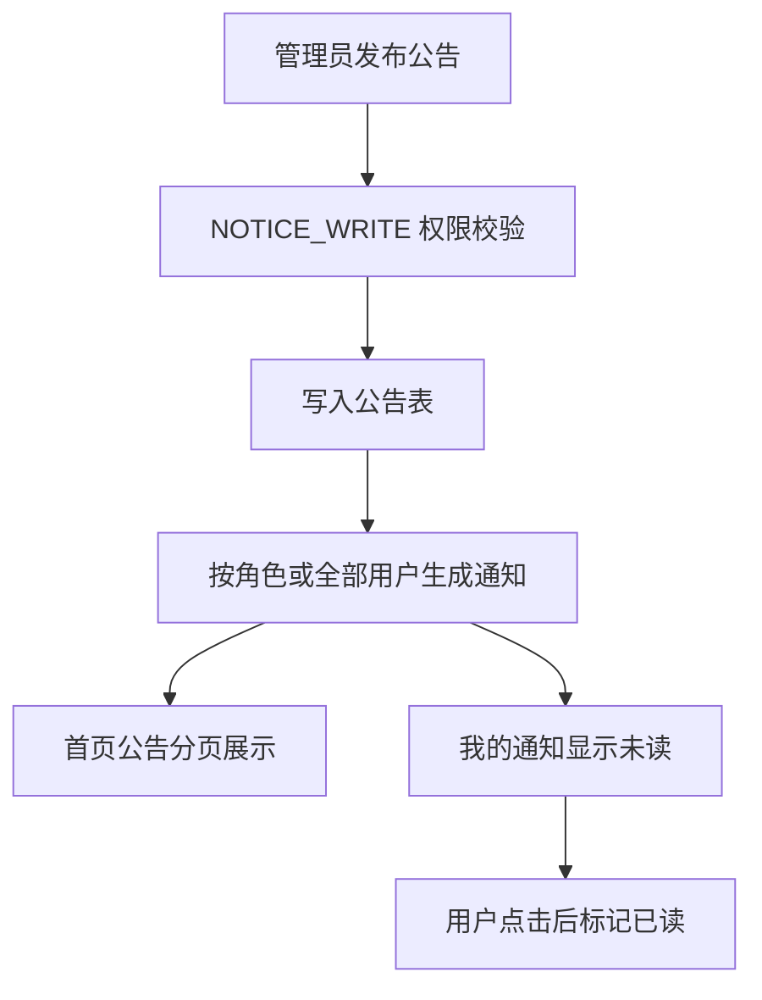
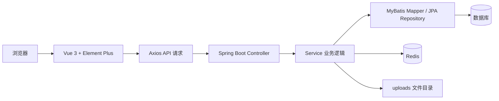

# 教学综合信息服务平台成员分工与技术实现说明

本文档用于说明三位成员在项目中的开发分工、已实现功能、对应代码文件、使用技术，以及流程图应该如何构成。

项目整体技术路线：

- 后端：Spring Boot、Spring MVC、Spring Security、MyBatis、JPA、Bean Validation、Flyway、Redis、H2/MySQL。
- 前端：Vue 3、TypeScript、Vite、Vue Router、Pinia、Axios、Element Plus、ECharts、Lucide 图标。
- 数据：开发环境使用 Flyway 建表，`DataInitializer` 初始化学院、专业、班级、学生、教师、课程、成绩、考试、菜单、权限等演示数据。
- 接口风格：后端统一返回 `ApiResponse<T>`，分页数据使用 `PageResponse<T>`。

## 一、魏语石（组长）

### 1. 负责范围

魏语石负责项目总体架构、登录认证、权限体系、后台管理、公共响应结构、异常处理、审计日志、菜单体系和前端整体布局。

主要目标是让系统先形成完整骨架：用户能登录，前端能带 token 请求接口，后端能识别身份，菜单能按角色展示，管理员能维护用户和权限。

### 2. 已实现功能

#### 登录认证

实现了账号密码登录、密码 BCrypt 校验、登录失败次数限制、访问令牌生成、刷新令牌生成和退出登录。

对应代码：

- `src/main/java/weidonglang/tianshiwebside/auth/AuthController.java`
- `src/main/java/weidonglang/tianshiwebside/auth/AuthService.java`
- `src/main/java/weidonglang/tianshiwebside/auth/AuthTokenStore.java`
- `src/main/java/weidonglang/tianshiwebside/auth/dto/LoginRequest.java`
- `src/main/java/weidonglang/tianshiwebside/auth/dto/LoginResponse.java`
- `frontend/src/views/auth/LoginView.vue`
- `frontend/src/api/auth.ts`
- `frontend/src/stores/auth.ts`

使用技术：

- Spring MVC：通过 `@RestController` 提供 `/api/auth/login` 等认证接口。
- Spring Security：使用 `PasswordEncoder` 做密码加密与校验。
- Redis：使用 `StringRedisTemplate` 存储访问令牌、刷新令牌和登录失败次数。
- Pinia：保存前端登录态、token 和用户信息。
- Axios：登录时调用后端接口，并在后续请求中携带 `Authorization: Bearer <token>`。
- Vue Router：未登录访问业务页面时跳转到 `/login`。

核心流程：

1. 用户在登录页输入用户名和密码。
2. 前端调用 `loginApi`。
3. 后端 `AuthService` 查询用户账号。
4. 使用 BCrypt 校验密码。
5. 登录成功后生成 access token 和 refresh token。
6. `AuthTokenStore` 将 token 写入 Redis，同时保留本地内存 fallback，方便本地 Redis 不可用时继续开发。
7. 前端 Pinia 保存 token，路由进入主界面。

#### 权限与安全控制

实现了角色权限、接口权限和管理员接口保护。

对应代码：

- `src/main/java/weidonglang/tianshiwebside/security/SecurityConfig.java`
- `src/main/java/weidonglang/tianshiwebside/security/BearerTokenAuthenticationFilter.java`
- `src/main/java/weidonglang/tianshiwebside/permission/RolePermissionController.java`
- `src/main/java/weidonglang/tianshiwebside/permission/MenuController.java`
- `src/main/java/weidonglang/tianshiwebside/permission/mapper/RolePermissionMapper.java`
- `frontend/src/views/admin/RolePermissionAdminView.vue`
- `frontend/src/api/rolePermission.ts`
- `frontend/src/stores/menu.ts`

使用技术：

- Spring Security Filter：`BearerTokenAuthenticationFilter` 从请求头读取 token，查询用户身份和权限。
- `@PreAuthorize`：对关键接口做细粒度权限控制，例如 `GRADE_WRITE`、`COURSE_WRITE`、`STATUS_REVIEW`。
- MyBatis：查询角色、菜单、权限和用户授权关系。
- Vue Router + 动态菜单：前端根据后端返回菜单生成可见入口。

核心流程：

1. 前端请求接口时自动携带 Bearer token。
2. 后端过滤器解析 token。
3. 根据 token 找到用户名，再查询用户角色和权限。
4. Spring Security 将角色和权限放入当前认证上下文。
5. 访问 `/api/admin/**` 必须具备管理员角色。
6. 访问带 `@PreAuthorize` 的接口必须具备具体权限码。

#### 后台用户管理

实现了管理员查看用户、创建测试用户、重置密码、分配角色等能力。

对应代码：

- `src/main/java/weidonglang/tianshiwebside/user/AdminUserController.java`
- `src/main/java/weidonglang/tianshiwebside/user/mapper/AdminUserMapper.java`
- `src/main/java/weidonglang/tianshiwebside/user/mapper/UserAccountMapper.java`
- `frontend/src/views/admin/UserAdminView.vue`
- `frontend/src/api/adminUser.ts`

使用技术：

- Spring MVC：提供后台用户管理接口。
- MyBatis：执行用户、角色、用户角色关系查询和写入。
- Bean Validation：校验请求参数。
- Element Plus：前端表格、表单、弹窗和操作按钮。

#### 操作日志与审计

记录谁修改了教学班、谁审核了申请、谁发布了公告、谁调整了角色权限等关键操作。

对应代码：

- `src/main/java/weidonglang/tianshiwebside/audit/AuditLogService.java`
- `src/main/java/weidonglang/tianshiwebside/audit/AuditLogController.java`
- `src/main/java/weidonglang/tianshiwebside/audit/mapper/AuditLogMapper.java`
- `frontend/src/views/admin/AuditLogView.vue`
- `frontend/src/api/audit.ts`

使用技术：

- MyBatis：插入和查询审计日志。
- Spring MVC：提供审计列表接口。
- Element Plus：使用表格展示操作人、动作、对象、详情、时间。

### 3. Redis 功能

魏语石负责的 Redis 功能主要在认证模块：

- `auth:access:{token}`：保存 access token 对应的用户名。
- `auth:refresh:{token}`：保存 refresh token 对应的用户名。
- `auth:failures:{username}`：保存登录失败次数，超过阈值后临时锁定。

对应代码：

- `AuthService`：登录失败次数递增、设置过期时间、登录成功后清理失败次数。
- `AuthTokenStore`：保存和查询 token，Redis 不可用时使用内存 fallback。

技术意义：

- Redis 适合保存短期登录状态。
- token 设置 TTL 后可以自动过期。
- 登录失败次数放入 Redis，可以避免频繁写数据库。

## 二、郭凤圣

### 1. 负责范围

郭凤圣负责学生端课程业务，包括课程查询、自主选课、抢课、退课、个人课表、空闲教室和课程相关基础数据展示。

主要目标是让学生能完成从“查课程”到“选课程”再到“查看课表”的完整闭环。

### 2. 已实现功能

#### 自主选课与退课

实现了可选课程列表、已选课程列表、选课、抢课入口、退课和选课时间窗口判断。

对应代码：

- `src/main/java/weidonglang/tianshiwebside/course/CourseSelectionController.java`
- `src/main/java/weidonglang/tianshiwebside/course/mapper/CourseSelectionReadMapper.java`
- `src/main/java/weidonglang/tianshiwebside/course/mapper/CourseSelectionWriteMapper.java`
- `src/main/java/weidonglang/tianshiwebside/course/mapper/CourseOfferingRow.java`
- `src/main/java/weidonglang/tianshiwebside/course/mapper/CourseSelectionRow.java`
- `frontend/src/views/course/SelectionView.vue`
- `frontend/src/api/courseSelection.ts`

使用技术：

- Spring MVC：通过 `/api/course-selection/offerings`、`/selected`、`/grab` 提供选课接口。
- MyBatis：读取教学班、已选课程、学生信息，并写入选课记录。
- Redis：抢课时做库存、短锁、幂等控制。
- Vue 3 + Element Plus：前端使用表格展示课程，使用按钮触发选课/退课。

核心流程：

1. 学生进入自主选课页面。
2. 前端调用课程列表接口。
3. 后端根据学生账号和当前学期查询可选课程。
4. 学生点击选课或抢课。
5. 后端校验学生身份、选课窗口、是否重复选课、课程容量。
6. 成功后写入选课记录。
7. 前端刷新已选课程和课程余量。

#### 抢课模块与微服务预留

抢课模块被抽象成接口 `CourseGrabPort`，当前使用本地实现 `LocalCourseGrabService`，同时预留远程客户端 `RemoteCourseGrabClient`，以后可以拆成独立选课抢课微服务。

对应代码：

- `src/main/java/weidonglang/tianshiwebside/course/grab/CourseGrabPort.java`
- `src/main/java/weidonglang/tianshiwebside/course/grab/CourseGrabCommand.java`
- `src/main/java/weidonglang/tianshiwebside/course/grab/CourseGrabResult.java`
- `src/main/java/weidonglang/tianshiwebside/course/grab/CourseGrabFailureReason.java`
- `src/main/java/weidonglang/tianshiwebside/course/grab/LocalCourseGrabService.java`
- `src/main/java/weidonglang/tianshiwebside/course/grab/RemoteCourseGrabClient.java`
- `docs/microservice-boundaries.md`

使用技术：

- 面向接口编程：Controller 依赖 `CourseGrabPort`，不直接依赖具体实现。
- Spring 条件装配：`LocalCourseGrabService` 使用 `@ConditionalOnMissingBean(RemoteCourseGrabClient.class)`，当没有远程客户端时使用本地服务。
- Redis：用短期 key 处理高并发抢课中的库存、幂等和锁。
- 事务：选课落库过程使用 `@Transactional` 保证数据库一致性。

#### 个人课表与空闲教室

实现了学生个人课表、周一到周五课程展示、空闲教室查询。

对应代码：

- `src/main/java/weidonglang/tianshiwebside/schedule/PersonalScheduleController.java`
- `src/main/java/weidonglang/tianshiwebside/academic/AcademicQueryController.java`
- `src/main/java/weidonglang/tianshiwebside/academic/AcademicQueryMapper.java`
- `src/main/java/weidonglang/tianshiwebside/information/InformationCenterController.java`
- `frontend/src/views/schedule/PersonalScheduleView.vue`
- `frontend/src/views/schedule/FreeClassroomView.vue`
- `frontend/src/views/information/InformationQueryView.vue`
- `frontend/src/api/schedule.ts`
- `frontend/src/api/information.ts`

使用技术：

- MyBatis：按学生、班级、学期、周次查询课程数据。
- Vue 3：前端将课程数据渲染成课表格子。
- Element Plus：下拉筛选、表格、标签。

#### 数据初始化

补充了学院、专业、班级、学生、课程、课表、成绩、考试安排等演示数据。

对应代码：

- `src/main/java/weidonglang/tianshiwebside/config/DataInitializer.java`
- `src/main/resources/db/migration/V1__initial_schema.sql`
- `src/main/resources/db/migration/V7__information_center.sql`

已覆盖的数据范围：

- 信息科学与工程学院：计算机科学与技术、人工智能、无人机、软件工程、电子信息工程、通信工程。
- 医学院：护理学、康复治疗学。
- 经济管理学院：财务管理、市场营销。
- 艺术学院：视觉传达设计、数字媒体艺术。
- 每个专业至少两个班，每个班至少五名学生。
- 周一到周五都有课程。

### 3. Redis 功能

郭凤圣负责的 Redis 功能集中在抢课：

- `selection:offering:{offeringId}:remaining`：课程剩余容量。
- `selection:grab:lock:{offeringId}:{username}`：同一学生同一课程的短期处理锁。
- `selection:request:{requestId}`：抢课请求幂等 key，防止重复提交。

对应代码：

- `LocalCourseGrabService#reserveStock`
- `LocalCourseGrabService#tryLock`
- `LocalCourseGrabService#markRequestProcessing`
- `LocalCourseGrabService#cacheRequestResult`
- `AdminCourseController#evictOfferingStock`

技术意义：

- Redis `decrement` 可以快速减少课程余量，适合抢课场景。
- Redis `setIfAbsent` 可以实现简单短锁。
- 请求幂等 key 可以避免用户重复点击造成重复选课。
- 数据库仍然是最终数据源，Redis 是高并发保护层。

## 三、敖东磊

### 1. 负责范围

敖东磊负责教师端、成绩管理后台、考试管理后台、通知公告、教学评价、文件导入导出和部分学生申请审核页面。

主要目标是让教师和管理员能维护教学过程中的结果数据，包括成绩、考试、评价和通知。

### 2. 已实现功能

#### 教师端

实现了教师登录身份下的任课课程查看、成绩查看、考试安排查看和教学评价结果查看。

对应代码：

- `src/main/java/weidonglang/tianshiwebside/teacher/TeacherController.java`
- `src/main/java/weidonglang/tianshiwebside/teacher/mapper/TeacherMapper.java`
- `frontend/src/views/teacher/TeacherOfferingsView.vue`
- `frontend/src/views/teacher/TeacherGradesView.vue`
- `frontend/src/views/teacher/TeacherExamsView.vue`
- `frontend/src/views/teacher/TeacherEvaluationsView.vue`
- `frontend/src/api/teacher.ts`

使用技术：

- Spring Security：`/api/teacher/**` 只允许教师和管理员访问。
- MyBatis：按教师姓名和学期查询任课课程、成绩、考试、评价统计。
- Vue Router：教师端菜单路由独立配置。
- Element Plus：表格展示教师业务数据。

核心流程：

1. 教师账号登录。
2. 后端通过认证上下文拿到用户名。
3. `TeacherMapper` 查询用户名对应的显示姓名。
4. 按教师姓名查询任课教学班、成绩、考试和评价。
5. 前端展示教师工作台页面。

#### 成绩管理后台

实现了成绩后台查询、新增、修改、锁定、补考/重修/缓考状态、导入、导出。

对应代码：

- `src/main/java/weidonglang/tianshiwebside/academic/AcademicAdminController.java`
- `src/main/java/weidonglang/tianshiwebside/academic/mapper/AcademicAdminMapper.java`
- `src/main/java/weidonglang/tianshiwebside/academic/AcademicGrade.java`
- `src/main/java/weidonglang/tianshiwebside/academic/AcademicGradeRepository.java`
- `frontend/src/views/admin/GradeAdminView.vue`
- `frontend/src/api/academicAdmin.ts`

使用技术：

- Spring MVC：提供 `/api/admin/academic/grades` 系列接口。
- `@PreAuthorize`：`GRADE_READ` 控制查看，`GRADE_WRITE` 控制录入和修改。
- Bean Validation：校验分数范围、课程、学号、考试类型、成绩状态。
- MyBatis：查询和写入成绩。
- MultipartFile：处理 CSV 导入。
- CSV 文本导出：提供 `grades/export-csv`。
- 审计日志：新增、修改、导入成绩时记录操作。

核心流程：

1. 管理员进入成绩管理页面。
2. 前端按学期、关键字请求成绩列表。
3. 后端检查权限。
4. 新增或修改成绩时校验学生、课程和锁定状态。
5. 写入成绩表。
6. 记录审计日志。
7. 前端刷新成绩列表。

#### 考试管理后台

实现了考试安排维护、考场、座位、监考信息维护，并与学生考试安排联动。

对应代码：

- `src/main/java/weidonglang/tianshiwebside/academic/AcademicAdminController.java`
- `src/main/java/weidonglang/tianshiwebside/academic/ExamSchedule.java`
- `src/main/java/weidonglang/tianshiwebside/academic/ExamScheduleRepository.java`
- `src/main/java/weidonglang/tianshiwebside/academic/mapper/AcademicAdminMapper.java`
- `frontend/src/views/admin/ExamAdminView.vue`
- `frontend/src/views/exam/ExamQueryView.vue`
- `frontend/src/api/academic.ts`
- `frontend/src/api/academicAdmin.ts`

使用技术：

- Spring MVC：提供考试查询、新增、修改、删除接口。
- `@PreAuthorize("hasAuthority('EXAM_WRITE')")`：限制考试维护权限。
- MyBatis：查询考试安排和学生选课用户。
- 通知服务：考试安排新增或修改后通知已选该课程的学生。
- Element Plus：后台表单维护考试时间、教室、座位、考试类型、监考教师。

核心流程：

1. 管理员创建或修改考试安排。
2. 后端校验教学班是否存在。
3. 写入或更新考试安排。
4. 查询该教学班下已选课学生对应的用户 ID。
5. 发送考试通知。
6. 学生端考试查询页面能看到最新安排。

#### 通知公告

实现了首页公告、分类通知、通知发布、角色定向通知、已读/未读状态。

对应代码：

- `src/main/java/weidonglang/tianshiwebside/notice/NoticeController.java`
- `src/main/java/weidonglang/tianshiwebside/notice/AdminNoticeController.java`
- `src/main/java/weidonglang/tianshiwebside/notice/NotificationService.java`
- `src/main/java/weidonglang/tianshiwebside/notice/mapper/NoticeMapper.java`
- `frontend/src/views/admin/NoticeAdminView.vue`
- `frontend/src/api/notice.ts`
- `frontend/src/views/dashboard/DashboardView.vue`

使用技术：

- Spring MVC：提供首页公告和我的通知接口。
- MyBatis：查询公告列表、通知列表，写入通知记录，更新已读状态。
- 分页：使用 `PageResponse<T>` 返回公告分页和通知分页。
- 权限：发布公告需要 `NOTICE_WRITE`。
- Element Plus：公告列表、通知表格、发布表单。

#### 教学评价

实现了学生教学评价、后台评价统计和教师端评价结果查看。

对应代码：

- `src/main/java/weidonglang/tianshiwebside/evaluation/TeachingEvaluationController.java`
- `src/main/java/weidonglang/tianshiwebside/evaluation/AdminTeachingEvaluationController.java`
- `src/main/java/weidonglang/tianshiwebside/evaluation/mapper/TeachingEvaluationMapper.java`
- `frontend/src/views/evaluation/EvaluationView.vue`
- `frontend/src/views/admin/EvaluationAdminView.vue`
- `frontend/src/views/teacher/TeacherEvaluationsView.vue`
- `frontend/src/api/evaluation.ts`

使用技术：

- Spring MVC：学生端提交评价，后台和教师端查询评价结果。
- MyBatis：评价任务、评价记录、统计结果查询。
- ECharts：后台评价统计可视化。
- Element Plus：评价表单和统计表格。

#### 文件导入导出与材料上传

实现了课程 CSV 导入导出、成绩 CSV 导入导出、学籍申请材料上传。

对应代码：

- `src/main/java/weidonglang/tianshiwebside/course/AdminCourseController.java`
- `src/main/java/weidonglang/tianshiwebside/academic/AcademicAdminController.java`
- `src/main/java/weidonglang/tianshiwebside/file/StatusChangeAttachmentController.java`
- `src/main/java/weidonglang/tianshiwebside/file/StatusChangeAttachmentMapper.java`
- `frontend/src/views/admin/CourseOfferingAdminView.vue`
- `frontend/src/views/admin/GradeAdminView.vue`
- `frontend/src/views/student/StatusChangeView.vue`

使用技术：

- MultipartFile：接收上传文件。
- CSV：通过文本方式实现导入导出，降低依赖复杂度。
- 本地文件目录：上传材料保存到 `uploads`。
- MyBatis：保存附件元信息。

### 3. Redis 功能

敖东磊负责的业务模块和 Redis 的直接关联主要体现在后台维护后的缓存一致性配合：

- 当管理员修改教学班容量、教室、时间等信息后，需要清理抢课库存缓存。
- 当前代码中由 `AdminCourseController#evictOfferingStock` 删除 `selection:offering:{offeringId}:remaining`。
- 这保证后台修改容量后，下一次抢课会重新根据数据库计算剩余容量。

对应代码：

- `src/main/java/weidonglang/tianshiwebside/course/AdminCourseController.java`
- `LocalCourseGrabService#ensureStockKey`
- `LocalCourseGrabService#stockKey`

说明：

当前项目中成绩、考试和教师端查询还没有单独写 Redis 查询缓存。若后续继续增强，可以给敖东磊负责的模块补充以下缓存：

- `teacher:courses:{teacherId}`：教师任课课程缓存。
- `exam:schedule:{studentId}:{term}`：学生考试安排缓存。
- `grade:view:{studentId}:{term}`：学生成绩查询缓存。

这些属于合理扩展点，但本文档把“已写入代码”的 Redis 落点和“后续可扩展”的 Redis 落点区分开。

## 四、公共技术实现

### 1. 数据库与初始化

对应代码：

- `src/main/resources/db/migration/V1__initial_schema.sql`
- `src/main/resources/db/migration/V2__role_menu_permissions.sql`
- `src/main/resources/db/migration/V3__teaching_evaluation.sql`
- `src/main/resources/db/migration/V4__teacher_grade_exam_management.sql`
- `src/main/resources/db/migration/V5__notice_permission_audit_files.sql`
- `src/main/resources/db/migration/V6__registration_applications.sql`
- `src/main/resources/db/migration/V7__information_center.sql`
- `src/main/java/weidonglang/tianshiwebside/config/DataInitializer.java`

使用技术：

- Flyway：按版本管理数据库表结构。
- JPA Repository：部分基础数据使用实体和 Repository 初始化。
- JdbcTemplate：复杂演示数据使用 SQL 快速插入。
- MyBatis：业务查询和后台列表主要使用 Mapper。

### 2. 前端工程

对应代码：

- `frontend/package.json`
- `frontend/vite.config.ts`
- `frontend/src/main.ts`
- `frontend/src/router/index.ts`
- `frontend/src/layouts/MainLayout.vue`
- `frontend/src/styles/main.css`
- `frontend/src/api/http.ts`

使用技术：

- Vue 3：组件化页面开发。
- TypeScript：增强接口类型约束。
- Vite：前端开发和构建工具。
- Element Plus：表格、表单、弹窗、菜单、分页、按钮等 UI。
- Pinia：保存登录状态和菜单状态。
- Vue Router：管理页面路由和登录守卫。
- Axios：统一请求后端接口。

### 3. 后端公共结构

对应代码：

- `src/main/java/weidonglang/tianshiwebside/common/api/ApiResponse.java`
- `src/main/java/weidonglang/tianshiwebside/common/api/PageResponse.java`
- `src/main/java/weidonglang/tianshiwebside/common/error/BusinessException.java`
- `src/main/java/weidonglang/tianshiwebside/common/error/GlobalExceptionHandler.java`
- `src/main/java/weidonglang/tianshiwebside/common/web/TraceIdFilter.java`

使用技术：

- 统一响应：成功和失败都返回统一 JSON 结构。
- 全局异常处理：业务异常、参数校验异常、系统异常统一处理。
- TraceId：每次请求生成追踪 ID，方便定位错误。
- 分页结构：列表接口统一返回当前页、每页条数、总数和数据列表。

## 五、流程图构成说明

下面是建议在答辩或展示文档中放置的流程图构成。流程图不需要画得很复杂，重点是让老师能看出系统的角色、模块、数据流和 Redis 使用位置。

### 1. 登录认证流程图

组成节点：

- 用户登录页
- Axios 登录请求
- `AuthController`
- `AuthService`
- 用户表查询
- BCrypt 密码校验
- Redis 保存 token
- Pinia 保存前端登录态
- 路由进入首页

建议流程：

### 2. 权限访问流程图

组成节点：

- 前端业务页面
- Axios 请求拦截器
- Bearer token
- `BearerTokenAuthenticationFilter`
- Redis 查询 token 归属
- 查询角色和权限
- Spring Security 鉴权
- Controller 业务接口

建议流程：

### 3. 选课抢课流程图

组成节点：

- 学生选课页面
- 课程列表接口
- 抢课请求
- `CourseSelectionController`
- `CourseGrabPort`
- Redis 幂等 key
- Redis 短锁
- Redis 课程库存
- 数据库选课记录
- 返回抢课结果

建议流程：

### 4. 成绩管理流程图

组成节点：

- 管理员成绩页面
- 成绩查询/录入/修改
- `AcademicAdminController`
- `@PreAuthorize` 权限判断
- 参数校验
- MyBatis 写入成绩表
- 审计日志
- 前端刷新

建议流程：

### 5. 考试安排流程图

组成节点：

- 管理员考试页面
- 新增/修改考试安排
- 教学班校验
- 写入考试表
- 查询已选课学生
- 通知服务
- 学生考试查询页面

建议流程：

### 6. 通知公告流程图

组成节点：

- 管理员公告页面
- 发布公告表单
- `AdminNoticeController`
- 权限校验
- 公告表
- 通知表
- 用户已读/未读状态
- 首页公告和我的通知

建议流程：

### 7. 总体系统架构流程图

组成节点：

- 浏览器
- Vue 3 页面
- Axios
- Spring Boot Controller
- Service
- MyBatis Mapper / JPA Repository
- 数据库
- Redis
- 文件目录 uploads

建议流程：

## 六、三人分工汇总表

| 成员 | 主要职责 | 主要前端页面 | 主要后端代码 | Redis 相关点 |
| --- | --- | --- | --- | --- |
| 魏语石 | 架构、登录、权限、用户、审计、菜单、布局 | `LoginView.vue`、`MainLayout.vue`、`UserAdminView.vue`、`RolePermissionAdminView.vue`、`AuditLogView.vue` | `AuthService`、`AuthTokenStore`、`SecurityConfig`、`BearerTokenAuthenticationFilter`、`RolePermissionController`、`AdminUserController`、`AuditLogService` | 登录 token、刷新 token、登录失败次数 |
| 郭凤圣 | 学生选课、抢课、课表、空闲教室、基础课程数据 | `SelectionView.vue`、`PersonalScheduleView.vue`、`FreeClassroomView.vue`、`InformationQueryView.vue` | `CourseSelectionController`、`LocalCourseGrabService`、`CourseSelectionReadMapper`、`CourseSelectionWriteMapper`、`PersonalScheduleController` | 课程库存、短锁、请求幂等 |
| 敖东磊 | 教师端、成绩后台、考试后台、评价、通知、文件导入导出 | `TeacherOfferingsView.vue`、`TeacherGradesView.vue`、`GradeAdminView.vue`、`ExamAdminView.vue`、`NoticeAdminView.vue`、`EvaluationAdminView.vue` | `TeacherController`、`AcademicAdminController`、`NoticeController`、`AdminNoticeController`、`TeachingEvaluationController`、`StatusChangeAttachmentController` | 后台维护后清理选课库存缓存；后续可扩展成绩、考试、教师课程缓存 |

## 七、答辩表达建议

可以这样概括项目特点：

本项目不是为了堆砌复杂技术，而是用课堂上真正学过的 Spring Boot、SSM、Vue 3、Element Plus 和 Redis，完成一个接近真实学校教务系统的业务复刻。我们重点实现了登录权限、学生选课、教师端、成绩考试、通知公告、操作审计和文件导入导出。Redis 没有被当成装饰，而是用在登录状态、失败次数限制、抢课库存、幂等请求和缓存一致性这些确实适合它的地方。
